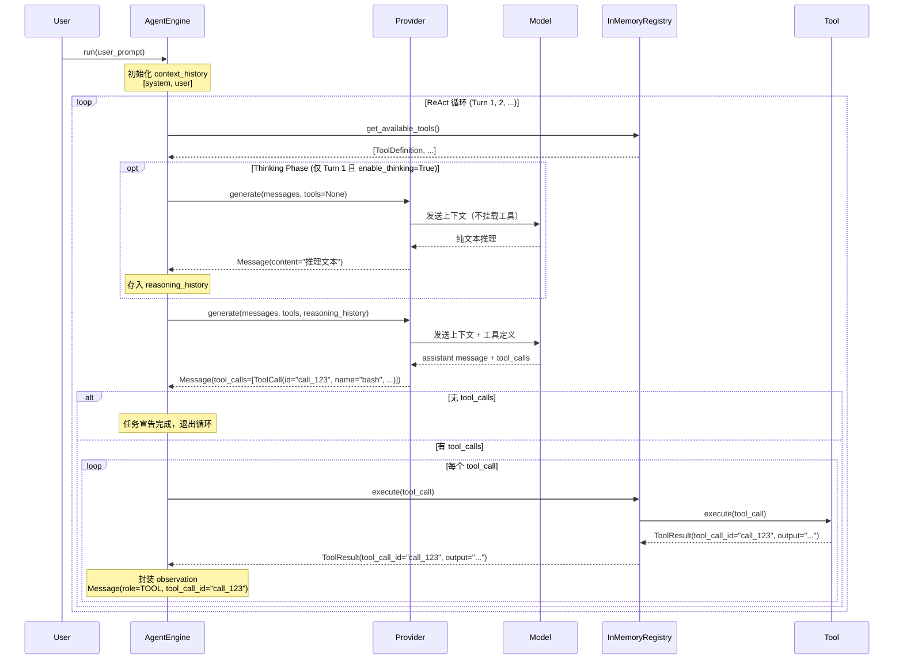

# my-harness

一个轻量级的 Python Agent 框架，基于 ReAct（Reasoning + Action + Observation）循环，支持大模型与工具的交互。

## 🎯 核心特性

- **ReAct 循环引擎** - 实现标准的 Agent 推理循环
- **工具调用系统** - 灵活的工具注册与分发机制
- **消息协议** - 基于 Pydantic 的类型安全消息定义
- **异步支持** - 支持并行工具执行与依赖管理
- **模块化架构** - 易于扩展的内部组件划分

## 📋 项目结构

```
my-harness/
├── cmd/
│   └── claw/
│       └── main.py              # 应用入口
├── internal/
│   ├── engine/
│   │   └── loop.py              # Agent 核心引擎 (ReAct 循环)
│   ├── provider/
│   │   ├── base.py              # LLMProvider 抽象接口
│   │   ├── MockProvider.py      # Mock 提供商（测试用）
│   │   └── OpenAIProvider.py    # OpenAI API 提供商
│   ├── schema/
│   │   └── message.py           # 消息类型定义 (Role, Message, ToolCall, ToolResult, ToolDefinition)
│   ├── tools/
│   │   ├── bsae_tool.py         # BaseTool 抽象基类
│   │   ├── registry.py          # ToolRegistry 抽象接口
│   │   ├── InMemoryRegistry.py  # 内存工具注册中心
│   │   ├── bash.py              # Bash 命令执行工具
│   │   ├── read_file.py         # 文件读取工具
│   │   ├── write_file.py        # 文件写入工具
│   │   └── get_weather.py       # 天气查询工具（演示用）
│   └── logger.py                # 日志配置
├── tests/
│   ├── test_engine.py           # 引擎集成测试
│   └── test_tools.py            # 工具单元测试
├── pyproject.toml               # 项目配置
└── README.md                    # 本文件
```

## 🚀 快速开始

### 安装

```bash
# 克隆项目
git clone <repo-url>
cd my-harness

# 创建虚拟环境
python3 -m venv .venv
source .venv/bin/activate  # macOS/Linux
# .venv\Scripts\activate  # Windows

# 安装依赖
pip install -e .
```
## 🏗️ 架构说明

### AgentEngine (核心引擎)

`AgentEngine` 实现了标准的 ReAct 循环：

```
Turn 1:
  1a. [可选] Reasoning (Thinking Phase)
      └─ 不挂载工具，让模型先进行纯文本推理
  1b. Action (Phase 2)
      └─ 挂载工具，模型决策并调用工具
  1c. Observation
      └─ 工具结果封装为 Tool Message，追加到上下文

Turn 2, 3, ...:
  2a. 模型携带 Observation 继续推理
  2b. 再次决策 → 调用工具 或 宣告任务完成
```

### 消息协议 (Message Schema)

```python
class Message(BaseModel):
    role: Role                      # system / user / assistant
    content: Optional[str]          # 文本内容
    tool_calls: Optional[List[ToolCall]]   # 工具调用请求
    tool_call_id: Optional[str]     # 工具调用ID（响应时）
```

### 工具系统 (InMemoryRegistry)

```python
class InMemoryRegistry(ToolRegistry):
    def __init__(self, tools: List[BaseTool]):
        # 注册工具，key 为 tool_definiton().name

    def get_available_tools(self) -> List[ToolDefinition]:
        """返回所有已挂载的工具 Schema"""

    def execute(self, tool_call: ToolCall) -> ToolResult:
        """根据 tool_call.name 路由到对应工具执行"""
```

## 🔄 工具并行执行

### 无依赖的并行执行

当模型请求多个独立的工具调用时，系统自动并行执行：

```python
# 如果模型同时请求 3 个工具：
tool_calls = [
    ToolCall(id="1", name="fetch_data", ...),
    ToolCall(id="2", name="fetch_config", ...),
    ToolCall(id="3", name="check_status", ...),
]

# 使用 asyncio.gather 并行执行，而非依次执行
results = await asyncio.gather(*tasks)  # 3个工具同时跑
```

### 有序执行（带依赖）

支持工具间的依赖关系：

```python
tool_calls = [
    ToolCall(id="1", name="fetch_data"),
    ToolCall(id="2", name="process", depends_on=["1"]),  # 需要等1完成
    ToolCall(id="3", name="save", depends_on=["2"]),     # 需要等2完成
]

# 执行顺序：1 → 2 → 3（最大化并行度，同时保证依赖）
```

## 📦 依赖

- **pydantic >= 2.13.3** - 数据验证与序列化
- **pyviz-comms >= 3.0.6** - 可视化通信

## 🛠️ 开发

### 添加新工具

1. 创建工具实现类
2. 注册到 `ToolRegistry`
3. 定义工具的 `ToolDefinition`

```python
class MyTool:
    async def execute(self, arguments):
        # 工具逻辑
        return "结果"

# 在 ToolRegistry 中
def get_available_tools(self):
    return [
        ToolDefinition(
            name="my_tool",
            description="工具描述",
            input_schema={...}
        )
    ]
```

### 接入大模型

实现 `LLMProvider` 接口：

```python
class OpenAIProvider:
    def generate(self, context_history, available_tools):
        # 调用 OpenAI API
        response = client.chat.completions.create(...)
        return Message(...)
```

## 📝 日志

项目使用 Python 标准 logging 模块：

```python
import logging
logger = logging.getLogger("Engine")
logger.info("Engine started")
```

**当前版本：0.1.0**  
**Python 要求：>= 3.14**


